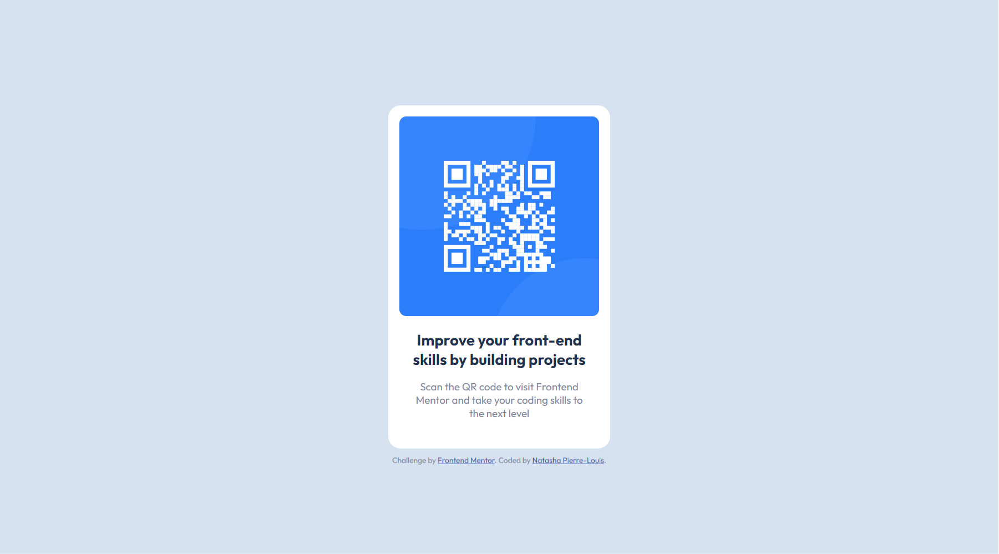

# Frontend Mentor - QR code component solution

This is my solution to the [QR code component challenge on Frontend Mentor](https://www.frontendmentor.io/challenges/qr-code-component-iux_sIO_H).

## Table of contents

- [Overview](#overview)
  - [Screenshot](#screenshot)
  - [Links](#links)
- [My process](#my-process)
  - [Built with](#built-with)
  - [What I learned](#what-i-learned)
  - [Useful resources](#useful-resources)
- [Author](#author)

## Overview

### Screenshot



### Links

- Solution URL: [https://github.com/natashapl/fem-qr-code-component](https://github.com/natashapl/fem-qr-code-component)
- Live Site URL: [Add live site URL here](https://your-live-site-url.com)

## My process

### Built with

- Semantic HTML5 markup
- CSS custom properties
- Flexbox

### What I learned

For this project, I decided to use some HTML5 semantic tags that I don't normally use such the "main"  and "article" tag. There were some rules that I wasn't aware of priot to this challenge.

```html
<main>
  <article>Content goes here</article>
</main>
```

### Useful resources

- [Flexbox: center horizontally and vertically](https://stackoverflow.com/questions/19026884/flexbox-center-horizontally-and-vertically) - This is a Stack Overflow solution that shows how to center elements using flexbox.
- [HTML5 Semantic Tags: What They Are and How to Use Them!](https://www.semrush.com/blog/semantic-html5-guide/) - This is an informative article that gives a good overview of the HTML5 semantic tags.

## Author

- Website - [Natasha Pierre-Louis](https://www.natashasfolio.com)
- Frontend Mentor - [@natashapl](https://www.frontendmentor.io/profile/natashapl)
- LinkedIn - [natashapl](https://www.linkedin.com/in/natashapl/)